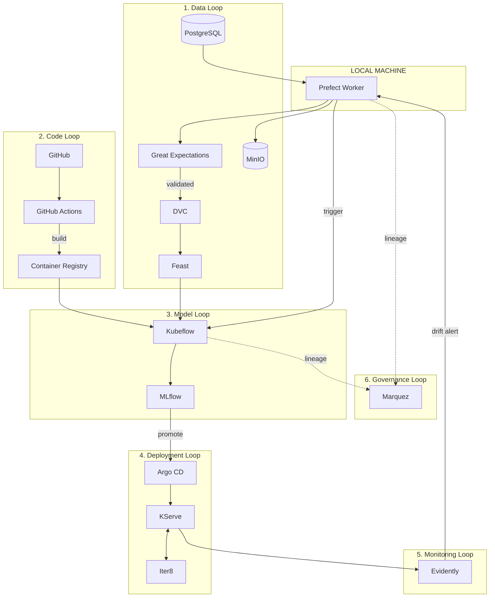
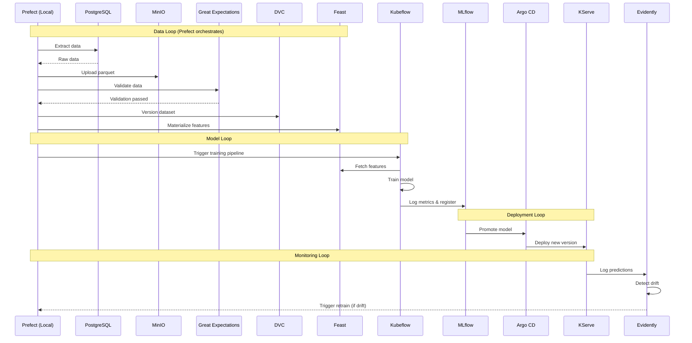

# The End-to-End MLOps Lifecycle (Prefect Edition)

This document traces the complete journey of a machine learning model from data ingestion to production API, using **Prefect Cloud + local worker** instead of Airflow for orchestration.

## Architecture Overview

```
┌─────────────────────────────────────────────────────────────────────────────┐
│                           YOUR LOCAL MACHINE                                │
│  ┌───────────────────────────────────────────────────────────────────────┐  │
│  │                    Prefect Worker (local process)                     │  │
│  │                                                                       │  │
│  │   Data Loop Tasks:                                                    │  │
│  │   ├── extract_from_postgres()    → PostgreSQL (k3s)                   │  │
│  │   ├── upload_to_minio()          → MinIO (k3s)                        │  │
│  │   ├── version_with_dvc()         → DVC + Git                          │  │
│  │   ├── validate_with_ge()         → Great Expectations                 │  │
│  │   ├── materialize_features()     → Feast (k3s)                        │  │
│  │   └── trigger_kubeflow()         → Kubeflow (k3s)                     │  │
│  └───────────────────────────────────────────────────────────────────────┘  │
│                                     │                                       │
│                                     ▼ (via kubeconfig)                      │
└─────────────────────────────────────┼───────────────────────────────────────┘
                                      │
┌─────────────────────────────────────▼───────────────────────────────────────┐
│                              K3s CLUSTER                                    │
│                                                                             │
│   ┌─────────────┐  ┌─────────────┐  ┌─────────────┐  ┌─────────────┐       │
│   │ PostgreSQL  │  │    MinIO    │  │    Feast    │  │  Kubeflow   │       │
│   └─────────────┘  └─────────────┘  └─────────────┘  └──────┬──────┘       │
│                                                              │              │
│                                                              ▼              │
│   ┌─────────────┐  ┌─────────────┐  ┌─────────────┐  ┌─────────────┐       │
│   │   Marquez   │  │  Evidently  │  │   KServe    │◄─│   MLflow    │       │
│   └─────────────┘  └─────────────┘  └──────┬──────┘  └─────────────┘       │
│                                            │                                │
│                                     ┌──────▼──────┐                         │
│                                     │    Iter8    │                         │
│                                     └─────────────┘                         │
└─────────────────────────────────────────────────────────────────────────────┘
```

---

## The 6 Stages of the Lifecycle

| Stage | Purpose | Tools |
|-------|---------|-------|
| 1. Data Loop | Get data ready | **Prefect**, DVC, Feast, Great Expectations, OpenLineage |
| 2. Code Loop | Validate code changes | Git, GitHub Actions (or Argo Workflows) |
| 3. Model Loop | Continuous Training | Kubeflow, MLflow, What-If Tool, Model Card Toolkit |
| 4. Deployment Loop | Continuous Deployment | Argo CD, KServe, Iter8 |
| 5. Monitoring Loop | Drift detection | Evidently AI |
| 6. Governance Loop | Lineage tracking | Marquez |

---

## 1. The Data Loop (Prefect + DVC + Feast + Great Expectations)

*Goal: Ensure training and serving use the same high-quality, validated, and traceable data.*

**Orchestrator: Prefect Cloud + Local Worker** (replaces Airflow)

```python
@flow(name="Data Ingestion Pipeline")
def data_pipeline():
    # 1. Extract from source
    local_path = extract_from_postgres()

    # 2. Upload to object storage
    s3_path = upload_to_minio(local_path)

    # 3. Validate data quality
    validate_with_great_expectations(local_path)

    # 4. Version dataset
    version_with_dvc(local_path)

    # 5. Materialize features
    materialize_feast_features()

    # 6. Emit lineage (optional)
    emit_openlineage_event(s3_path)
```

### Data Loop Flow

```
┌──────────────┐     ┌──────────────┐     ┌──────────────┐
│  PostgreSQL  │────▶│   Prefect    │────▶│    MinIO     │
│  (source)    │     │   (local)    │     │  (storage)   │
└──────────────┘     └──────┬───────┘     └──────────────┘
                           │
         ┌─────────────────┼─────────────────┐
         ▼                 ▼                 ▼
┌──────────────┐   ┌──────────────┐   ┌──────────────┐
│ Great Expect │   │     DVC      │   │    Feast     │
│ (validate)   │   │  (version)   │   │  (features)  │
└──────────────┘   └──────────────┘   └──────────────┘
```

---

## 2. The Code Loop (Git + CI)

*Goal: Ensure the training code itself is bug-free before we waste GPU hours.*

**For POC**: Manual or GitHub Actions (Argo Workflows optional)

```
┌──────────────┐     ┌──────────────┐     ┌──────────────┐
│    GitHub    │────▶│GitHub Actions│────▶│  Container   │
│   (code)     │     │   (CI)       │     │  Registry    │
└──────────────┘     └──────────────┘     └──────────────┘
```

Steps:
1. Push code to GitHub
2. CI runs tests (`pytest`)
3. Build Docker image with training code
4. Push to container registry

---

## 3. The Model Loop (Kubeflow + MLflow)

*Goal: Produce a trained, fair, and well-documented model artifact.*

**Triggered by**: Prefect task calling Kubeflow API

```python
@task(name="Trigger Kubeflow Training")
def trigger_kubeflow_training(data_path: str) -> str:
    client = kfp.Client(host="http://localhost:8080")  # port-forwarded

    run = client.create_run_from_pipeline_package(
        pipeline_file="pipelines/churn_training.yaml",
        arguments={"data_path": data_path}
    )

    return run.run_id
```

### Inside Kubeflow Pipeline

```
┌─────────────────────────────────────────────────────────────┐
│                    KUBEFLOW PIPELINE                        │
│                                                             │
│  ┌─────────┐    ┌─────────┐    ┌─────────┐    ┌─────────┐  │
│  │  Fetch  │───▶│  Train  │───▶│Evaluate │───▶│Register │  │
│  │ (Feast) │    │  (GPU)  │    │         │    │(MLflow) │  │
│  └─────────┘    └────┬────┘    └─────────┘    └─────────┘  │
│                      │                                      │
│                      ▼                                      │
│               ┌─────────────┐                               │
│               │   MLflow    │                               │
│               │  Tracking   │                               │
│               │             │                               │
│               │ • log_param │                               │
│               │ • log_metric│                               │
│               │ • log_model │                               │
│               └─────────────┘                               │
└─────────────────────────────────────────────────────────────┘
```

### MLflow Integration (inside training code)

```python
import mlflow

mlflow.set_tracking_uri("http://mlflow.mlflow.svc.cluster.local:5000")

with mlflow.start_run():
    # Training
    model = RandomForestClassifier(n_estimators=100)
    model.fit(X_train, y_train)

    # Log to MLflow
    mlflow.log_param("n_estimators", 100)
    mlflow.log_metric("accuracy", accuracy_score(y_test, predictions))
    mlflow.log_metric("f1", f1_score(y_test, predictions))

    # Save model artifact
    mlflow.sklearn.log_model(model, "churn_model")

    # Register to Model Registry
    mlflow.register_model(
        f"runs:/{mlflow.active_run().info.run_id}/churn_model",
        "ChurnModel"
    )
```

---

## 4. The Deployment Loop (Argo CD + KServe + Iter8)

*Goal: Update the production API without downtime, with automated validation.*

### Flow

```
┌──────────────┐     ┌──────────────┐     ┌──────────────┐
│   MLflow     │────▶│   Argo CD    │────▶│   KServe     │
│  Registry    │     │   (GitOps)   │     │  (serving)   │
│              │     │              │     │              │
│ "Promote to  │     │ Syncs k8s    │     │ Deploys new  │
│  Production" │     │ manifests    │     │ model pod    │
└──────────────┘     └──────────────┘     └──────┬───────┘
                                                 │
                                          ┌──────▼───────┐
                                          │    Iter8     │
                                          │              │
                                          │ • A/B test   │
                                          │ • Canary     │
                                          │ • SLO check  │
                                          └──────────────┘
```

### KServe InferenceService

```yaml
apiVersion: serving.kserve.io/v1beta1
kind: InferenceService
metadata:
  name: churn-predictor
  namespace: models
spec:
  predictor:
    model:
      modelFormat:
        name: sklearn
      storageUri: s3://mlflow-artifacts/ChurnModel/v5
```

---

## 5. The Monitoring Loop (Evidently AI)

*Goal: Close the feedback loop.*

```
┌──────────────┐     ┌──────────────┐     ┌──────────────┐
│   KServe     │────▶│  Evidently   │────▶│   Prefect    │
│ (predictions)│     │  (drift)     │     │  (retrain)   │
└──────────────┘     └──────────────┘     └──────────────┘
```

### Drift Detection Task (Prefect)

```python
@task(name="Check Data Drift")
def check_drift() -> bool:
    from evidently.report import Report
    from evidently.metric_preset import DataDriftPreset

    report = Report(metrics=[DataDriftPreset()])
    report.run(reference_data=training_data, current_data=production_data)

    result = report.as_dict()
    drift_detected = result["metrics"][0]["result"]["dataset_drift"]

    return drift_detected

@flow(name="Drift Monitoring Pipeline")
def drift_monitoring():
    if check_drift():
        # Trigger retraining
        trigger_kubeflow_training()
```

---

## 6. The Governance Loop (Marquez)

*Goal: Provide end-to-end visibility, auditability, and compliance.*

```
┌──────────────┐     ┌──────────────┐     ┌──────────────┐
│   Prefect    │────▶│ OpenLineage  │────▶│   Marquez    │
│   (tasks)    │     │  (events)    │     │   (UI)       │
└──────────────┘     └──────────────┘     └──────────────┘
```

**Note**: OpenLineage integration with Prefect requires manual event emission (unlike Airflow's built-in plugin).

---

## Complete Flow Diagram



---

## Sequence Diagram



---

## Tool Comparison: Airflow vs Prefect

| Aspect | Airflow | Prefect |
|--------|---------|---------|
| **Runs on** | K3s cluster (scheduler, webserver, workers) | Local machine (single process) |
| **UI** | Self-hosted | Prefect Cloud (SaaS) |
| **Resource usage** | High | Minimal |
| **Scheduling** | Built-in | Prefect Cloud |
| **OpenLineage** | Native plugin | Manual integration |
| **Setup** | Complex (Helm, DB, etc.) | `uv add prefect` |
| **Best for** | Production | POC / Development |

---

## Complete Tool Stack (Prefect Edition)

| Category | Tools | Where it Runs |
|----------|-------|---------------|
| **Orchestration** | Prefect Cloud + Worker | Local machine |
| | Kubeflow Pipelines | K3s |
| | Argo CD | K3s |
| **Data Management** | DVC | Local + MinIO |
| | Feast | K3s |
| | MinIO | K3s |
| **Data Quality** | Great Expectations | Local (via Prefect) |
| **Data Lineage** | OpenLineage + Marquez | K3s |
| **Model Training** | Kubeflow Pipelines | K3s |
| | MLflow | K3s |
| **Model Serving** | KServe | K3s |
| | Iter8 | K3s |
| **Monitoring** | Evidently AI | Local (via Prefect) |
| **Database** | PostgreSQL | K3s |

---

## Prefect Use Cases Mapping

| Use Case | Prefect Flow | K3s Integration |
|----------|--------------|-----------------|
| UC1: Churn Prediction | `churn_prediction_pipeline` | PostgreSQL → MinIO → Kubeflow → MLflow → KServe |
| UC2: A/B Testing | `ab_testing_pipeline` | KServe → Iter8 |
| UC3: Drift Retraining | `drift_monitoring_pipeline` | Evidently → Kubeflow |
| UC4: Data Lineage | `lineage_pipeline` | OpenLineage → Marquez |
| UC5: Fairness & Docs | `fairness_pipeline` | What-If Tool → Model Card |
| UC6: GitOps Deploy | `gitops_pipeline` | Git → Argo CD → KServe |

---

## Quick Start

```bash
# 1. Setup Prefect
cd /home/sujith/github/rag/00_MLOps/04_usecases
uv sync
uv run prefect cloud login

# 2. Start worker
uv run prefect worker start --pool local-pool

# 3. Run data pipeline (new terminal)
uv run python -m uc_1_churn_prediction.flows.churn_pipeline

# 4. Monitor in Prefect Cloud UI
# https://app.prefect.cloud
```
