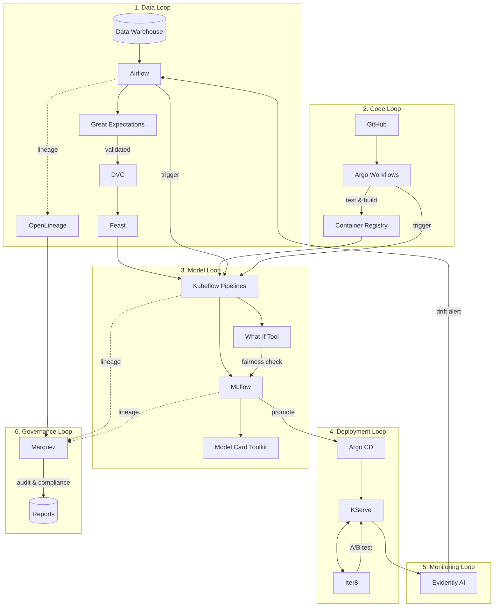
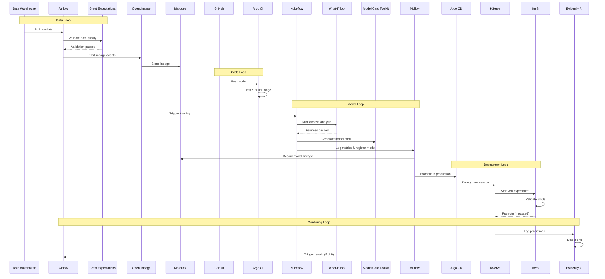

# The End-to-End Enterprise MLOps Lifecycle

This document traces the complete journey of a machine learning model from a developer's laptop to a production API. It illustrates how every tool in the architecture interacts to create a "Factory Pattern" for AI.

## The 6 Stages of the Lifecycle
1.  **Data Loop:** Getting data ready (Airflow, DVC, Feast, Great Expectations, OpenLineage).
2.  **Code (CI) Loop:** Validating code changes (Git, Argo Workflows).
3.  **Model (CT) Loop:** Continuous Training (Kubeflow, MLflow, What-If Tool, Model Card Toolkit).
4.  **Deployment (CD) Loop:** Continuous Deployment (Argo CD, KServe, Iter8).
5.  **Monitoring Loop:** Drift detection and alerts (Evidently AI).
6.  **Governance Loop:** Lineage tracking and visualization (Marquez).

---

## 1. The Data Loop (Airflow + DVC + Feast + Great Expectations + OpenLineage)
*Goal: Ensure training and serving use the same high-quality, validated, and traceable data.*

1.  **Ingestion:** **Apache Airflow** wakes up (Cron Schedule), pulls raw data from the Data Warehouse, and saves it to the Object Store (MinIO/S3).
2.  **Data Validation:** **Great Expectations** validates the ingested data:
    *   Schema validation (column types, required fields)
    *   Quality checks (null rates, value ranges, outlier detection)
    *   Freshness SLAs (data timestamp within expected window)
    *   Generates data docs and validation reports
3.  **Lineage Tracking:** **OpenLineage** (Airflow plugin) automatically captures:
    *   Data source → transformation → destination mappings
    *   Job metadata and run information
    *   Sends lineage events to **Marquez** for storage and visualization
4.  **Versioning:** A task in Airflow runs a **DVC** command to commit this new dataset version (e.g., `data_v2023_10.csv.dvc`) to Git.
5.  **Feature Engineering:** Airflow calculates features (e.g., `avg_clicks_7d`) and pushes them to the **Feast** Feature Store (Redis for online serving, Parquet for offline training).

---

## 2. The Code Loop (Git + Argo CI)
*Goal: Ensure the training code itself is bug-free before we waste GPU hours.*

1.  **Commit:** Data Scientist pushes code changes to **GitHub**.
2.  **CI Trigger:** **Argo Workflows** detects the commit.
3.  **Unit Tests:** Argo spins up a Pod to run `pytest`.
4.  **Linting:** Checks code style (black/pylint).
5.  **Build:** If tests pass, Argo **Builds a Docker Image** containing the training code and pushes it to the Container Registry.

---

## 3. The Model Loop (Kubeflow + MLflow + What-If Tool + Model Card Toolkit)
*Goal: Produce a trained, fair, and well-documented model artifact.*

1.  **Trigger:** Can be triggered manually, by Airflow (after new data arrives), or by Argo (after new code is merged).
2.  **Orchestration:** **Kubeflow Pipelines** spins up a sequence of Pods on Kubernetes:
    *   *Step A (Fetch):* Pulls training data from **Feast** (ensuring valid features).
    *   *Step B (Train):* Runs the Docker Image (built in Stage 2) on a GPU node.
    *   *Step C (Evaluate):* Tests the model against a hold-out set.
3.  **Tracking:** Inside the training code, `mlflow.log_metric()` sends accuracy/loss to the **MLflow Tracking Server**.
4.  **Fairness Analysis:** **What-If Tool** performs bias and fairness checks:
    *   Analyzes model behavior across different demographic slices
    *   Visualizes feature attribution and counterfactual analysis
    *   Identifies potential fairness issues before deployment
    *   Generates fairness reports for compliance
5.  **Model Documentation:** **Model Card Toolkit** generates standardized documentation:
    *   Model details (architecture, training data, intended use)
    *   Performance metrics across different evaluation slices
    *   Limitations and ethical considerations
    *   Stored alongside model artifacts in MLflow
6.  **Registration:** If the model passes evaluation (e.g., Accuracy > 90%) and fairness checks, the pipeline registers it to the **MLflow Model Registry** as `Model Version 5 (Staging)`.

---

## 4. The Deployment Loop (Argo CD + KServe + Iter8)
*Goal: Update the production API without downtime, with automated validation.*

### A. GitOps Promotion
1.  **Approval:** A senior engineer views the model in the **MLflow Registry UI** and clicks "Transition to Production".
2.  **CD Trigger:** This action triggers a webhook (or a script) that updates a **deployment.yaml** file in a separate "Ops Repo" in GitHub.
    *   *Change:* updates `image: my-model:v4` to `image: my-model:v5`.

### B. Sync & Serving
3.  **Sync:** **Argo CD** sees the change in GitHub and automatically syncs the Kubernetes Cluster.
4.  **Rollout:** **KServe** spins up the new model Pod.
    *   *Canary:* It can send 10% of traffic to the new model first.

### C. Automated Experimentation (Iter8)
5.  **Shadow Deployment:** **Iter8** can run the new model in shadow mode:
    *   Mirrors production traffic to new model without serving responses
    *   Collects latency, error rates, and resource usage metrics
    *   No impact on production users during validation
6.  **A/B Testing:** Iter8 orchestrates statistically valid experiments:
    *   Splits traffic between model versions (e.g., 90/10 split)
    *   Tracks business metrics (accuracy, latency p95, error rate)
    *   Runs Bayesian analysis for statistical significance
7.  **Performance Validation:** Iter8 validates SLOs before full rollout:
    *   Latency thresholds (e.g., p99 < 100ms)
    *   Error rate limits (e.g., < 0.1%)
    *   Memory/CPU constraints
8.  **Auto-Promotion/Rollback:** Based on experiment results:
    *   **Pass:** Iter8 signals KServe to route 100% traffic to new model
    *   **Fail:** Automatic rollback to previous version, alert sent

---

## 5. The Monitoring Loop (Evidently AI)
*Goal: Close the feedback loop.*

1.  **Live Checks:** Every request/response is logged.
2.  **Drift Analysis:** **Evidently AI** compares live data against the training data (from DVC).
3.  **Alert:** If Drift is detected (e.g., "Data is skewed"), Evidently sends an alert to **Airflow**.
4.  **Retrain:** Airflow automatically triggers the **Model Loop** (Stage 3) to retrain on the new live data, closing the cycle.

---

## 6. The Governance Loop (Marquez)
*Goal: Provide end-to-end visibility, auditability, and compliance.*

1.  **Lineage Visualization:** **Marquez** provides a unified UI to trace:
    *   Data flow from source systems through transformations to model training
    *   Which datasets were used to train which model versions
    *   Impact analysis: "If this table changes, which models are affected?"
2.  **Audit Trail:** Complete history of:
    *   Data pipeline runs and their inputs/outputs
    *   Model training jobs and artifacts produced
    *   Who approved which model for production
3.  **Compliance Reporting:** Generate reports for:
    *   Data provenance (GDPR: "Where did this prediction come from?")
    *   Model reproducibility (SOC2: "Can you recreate this model?")
    *   Fairness attestation (using What-If Tool reports)
4.  **Cross-System Integration:** Marquez aggregates lineage from:
    *   Airflow (via OpenLineage plugin)
    *   Kubeflow Pipelines (via OpenLineage integration)
    *   Feast feature store
    *   MLflow model registry

---

## Summary Diagram



---

## Sequence Diagram



---

## Complete Tool Stack

| Category | Tools | Purpose |
|----------|-------|---------|
| **Orchestration** | Apache Airflow | Data pipeline scheduling and orchestration |
| | Kubeflow Pipelines | ML workflow orchestration on Kubernetes |
| | Argo Workflows | CI pipeline execution |
| | Argo CD | GitOps continuous deployment |
| **Data Management** | DVC | Dataset versioning |
| | Feast | Feature store (online + offline) |
| **Data Quality** | Great Expectations | Data validation, schema checks, quality metrics |
| **Data Lineage** | OpenLineage + Marquez | End-to-end data and model lineage |
| **Model Training** | Kubeflow Pipelines | Distributed training orchestration |
| | MLflow | Experiment tracking and model registry |
| **Model Quality** | What-If Tool | Bias/fairness analysis and visualization |
| | Model Card Toolkit | Standardized model documentation |
| **Model Serving** | KServe | Serverless model inference |
| | Iter8 | A/B testing, shadow deployments, SLO validation |
| **Monitoring** | Evidently AI | Data drift and model performance monitoring |

---

## Tool Integration Matrix

```
                    ┌─────────────────────────────────────────────────────────────┐
                    │                    ENTERPRISE MLOPS                         │
                    ├─────────────────────────────────────────────────────────────┤
                    │                                                             │
                    │   ┌─────────────┐    ┌─────────────┐    ┌─────────────┐    │
                    │   │   AIRFLOW   │───▶│     DVC     │───▶│    FEAST    │    │
                    │   └──────┬──────┘    └─────────────┘    └──────┬──────┘    │
                    │          │                                      │           │
                    │          ▼                                      │           │
                    │   ┌─────────────┐                               │           │
                    │   │  GREAT EXP  │                               │           │
                    │   └──────┬──────┘                               │           │
                    │          │                                      │           │
                    │          ▼                                      ▼           │
                    │   ┌─────────────┐    ┌─────────────┐    ┌─────────────┐    │
                    │   │ OPENLINEAGE │───▶│   MARQUEZ   │◀───│  KUBEFLOW   │    │
                    │   └─────────────┘    └─────────────┘    └──────┬──────┘    │
                    │                                                 │           │
                    │                      ┌─────────────┐           │           │
                    │                      │ WHAT-IF TOOL│◀──────────┤           │
                    │                      └─────────────┘           │           │
                    │                                                 │           │
                    │                      ┌─────────────┐           │           │
                    │                      │ MODEL CARD  │◀──────────┤           │
                    │                      └─────────────┘           │           │
                    │                                                 ▼           │
                    │   ┌─────────────┐    ┌─────────────┐    ┌─────────────┐    │
                    │   │  EVIDENTLY  │◀───│   KSERVE    │◀───│   MLFLOW    │    │
                    │   └──────┬──────┘    └──────┬──────┘    └─────────────┘    │
                    │          │                  │                              │
                    │          │           ┌──────▼──────┐                       │
                    │          │           │    ITER8    │                       │
                    │          │           └─────────────┘                       │
                    │          │                                                 │
                    │          └──────────────────────────────────────────────▶  │
                    │                         (Retrain Trigger)                  │
                    │                                                             │
                    └─────────────────────────────────────────────────────────────┘
```

